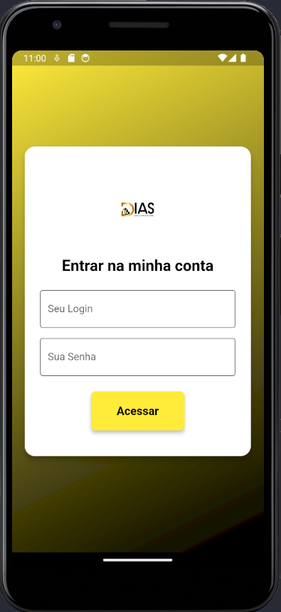

# mobile_flutter

Projeto mobile em Flutter com objetivo a criação do aplicativo multiplataforma.

# Projeto Flutter: Página de Login

Este projeto Flutter é uma aplicação simples que demonstra uma página de login. A página permite que o usuário insira seu nome de usuário e senha, e os dados são enviados para uma API Spring Boot para autenticação. Além disso, a página inclui botões para login com Google e Apple.

## Estrutura do Projeto

O projeto está estruturado da seguinte forma:

-   `lib/`
    -   `components/`
        -   `my_button.dart` – Um widget personalizado para o botão de login.
        -   `my_textfield.dart` – Um widget personalizado para os campos de texto.
        -   `square_tile.dart` – Um widget personalizado para os botões de login com Google e Apple.
    -   `login_page.dart` – A página de login principal.

## Página de Login

A página de login (`login_page.dart`) é a tela inicial da aplicação e possui os seguintes componentes:

-   **Ícone de Bloqueio**: Um ícone visual representando segurança.
-   **Mensagem de Boas-Vindas**: Um texto informativo para o usuário.
-   **Campos de Texto**: Campos para inserção do nome de usuário e senha.
-   **Botão de Login**: Um botão para enviar os dados de login para a API Spring Boot.
-   **Opções de Login com Google e Apple**: Botões para login usando contas do Google e Apple.
-   **Link de Registro**: Um texto que leva o usuário para a página de registro, caso ainda não tenha uma conta.

## Importação da Imagem

As imagens utilizadas na página de login (por exemplo, os ícones do Google e Apple) devem estar localizadas no diretório `lib/images/`. Certifique-se de que os arquivos de imagem (`google.png` e `apple.png`) estejam presentes neste diretório e que o caminho para as imagens esteja correto.

**Caminho das Imagens:**

-   `lib/images/google.png`
-   `lib/images/apple.png`
