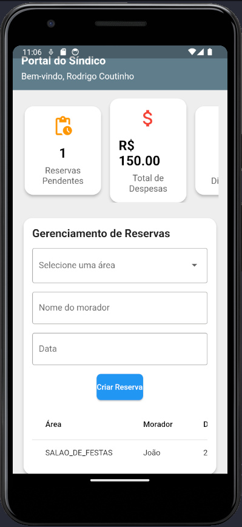

# Projeto de Aplicativo Multiplataforma em Flutter

Projeto mobile em Flutter com objetivo a criação do aplicativo multiplataforma.

# Projeto Flutter: Página de Login

Este projeto Flutter é uma aplicação simples que demonstra uma página de login. A página permite que o usuário insira seu nome de usuário e senha, e os dados são enviados para uma API Spring Boot para autenticação. O projeto também inclui uma página de registro, que permite que o usuário crie uma nova conta e acesse um sistema feito para sindicos.

## Página de Login

A página de login (`login_screen.dart`) é a tela inicial da aplicação e possui os seguintes componentes:

- **Campo de texto para o nome de usuário**: O usuário pode inserir seu nome de usuário neste campo.
- **Campo de texto para a senha**: O usuário pode inserir sua senha neste campo.
- **Botão de login**: O usuário pode clicar neste botão para enviar seus dados de login para a API Spring Boot.

A página de registro (`signup_screen.dart`) é acessada através de um botão na página de login e possui os seguintes componentes:

- **Campo de texto para o nome (login)**: O usuário pode inserir seu nome neste campo.
- **Campo de texto para o nome de usuário**: O usuário pode inserir seu nome de usuário neste campo.
- **Campo de texto para a senha**: O usuário pode inserir sua senha neste campo.
- **Botão de registro**: O usuário pode clicar neste botão para enviar seus dados de registro para a API Spring Boot.

A página do dashboard (`dashboard_screen.dart`) é acessada após o login e possui os seguintes componentes:

- **Cards**: O usuário pode visualizar suas receitas e despesas em cards.
- **Bem-vindo**: O usuário é recebido com uma mensagem de boas-vindas.
- **receitas e despesas**: O usuário pode visualizar suas receitas e despesas.

